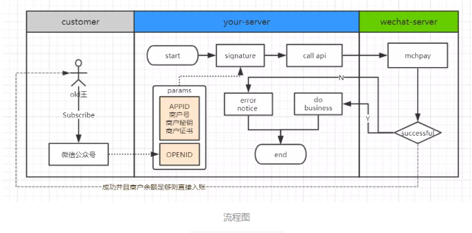
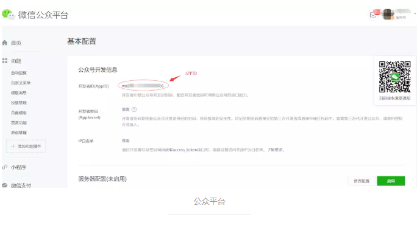
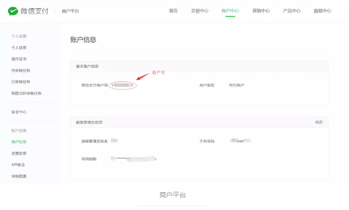
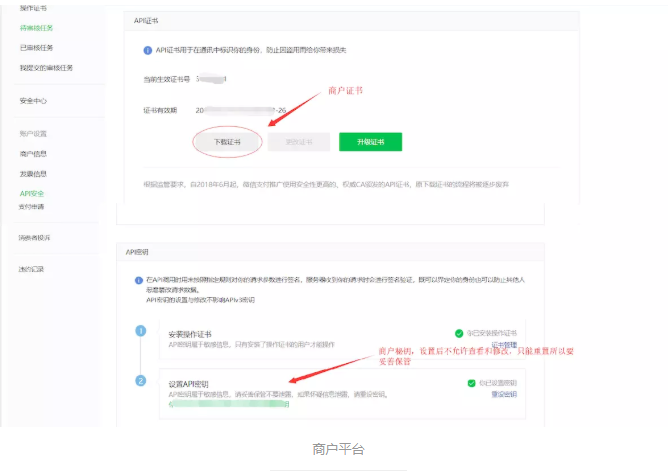
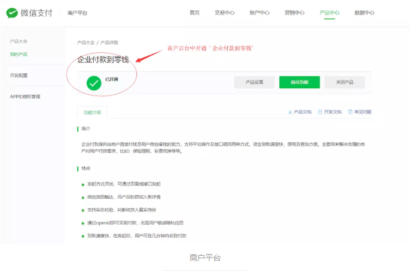
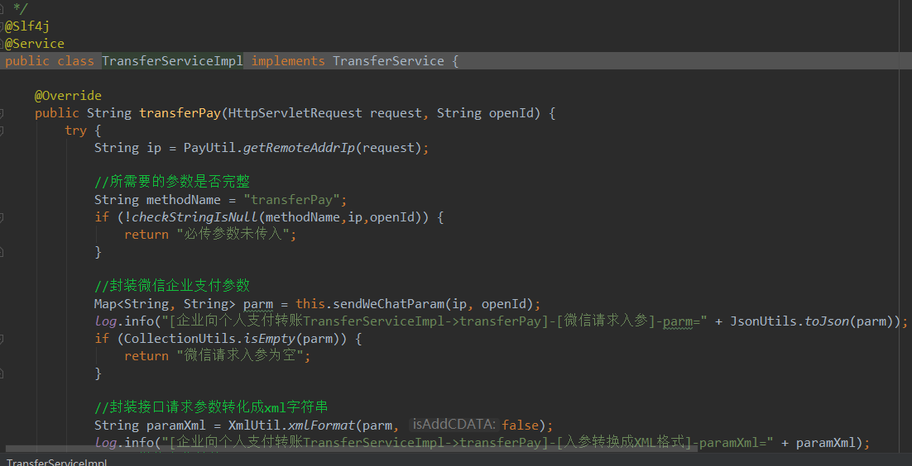
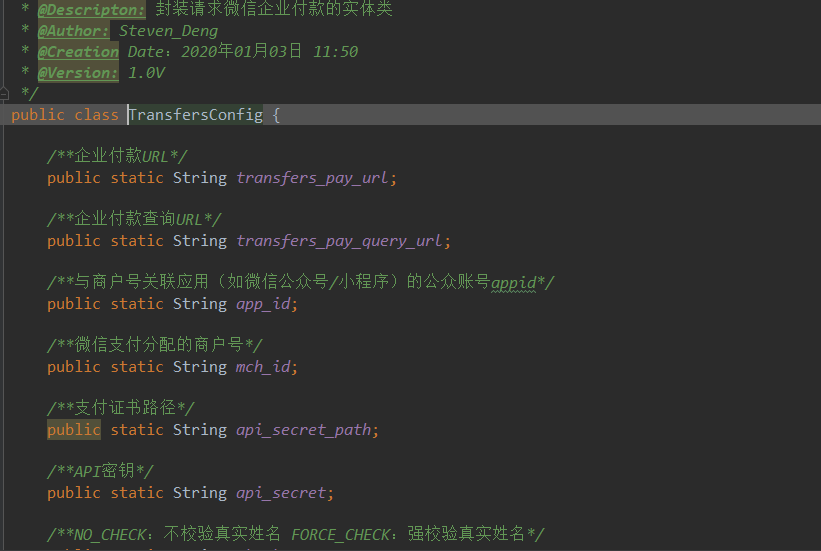
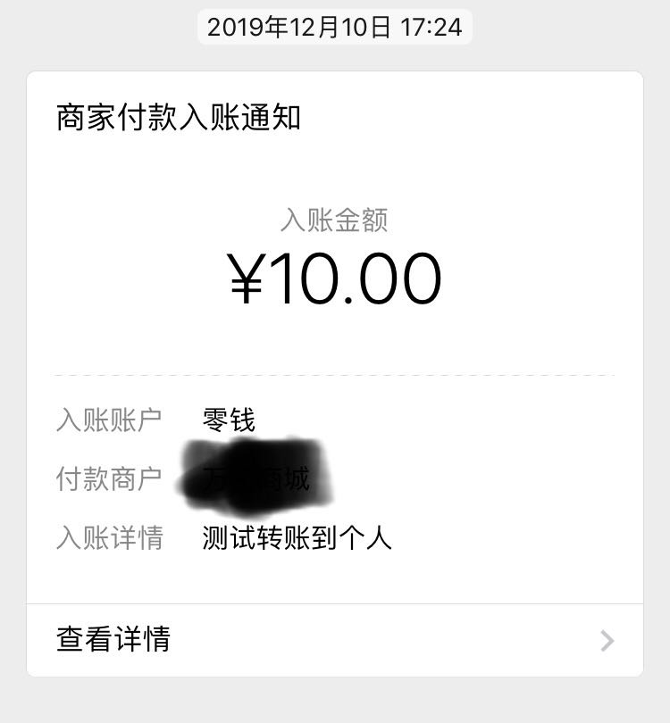
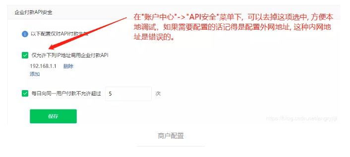

## WeChatPay

最近接到一个需求需要实现从企业付款到零钱分润的功能，简单记录一下微信企业付款到零钱的开发过程， 主要就是按规则封装好请求参数调用微信接口，涉及一些签名校验； 

### A.接口流程

1. 获取用户OPENID ，不同用户在不同公众号下的OPENID都是唯一的， 这里主要讲企业付款到零钱，已经实现微信获取用户信息的骚年可以跳过这一步
  https://mp.weixin.qq.com/wiki?t=resource/res_main&id=mp1421140839

2. 参数签名，需要将参数签名传递到微信企业付款接口，如果之前有实现其他微信接口，可以复用原来签名方法
  https://pay.weixin.qq.com/wiki/doc/api/tools/mch_pay.php?chapter=4_3

3. 调用企业付款接口
  https://pay.weixin.qq.com/wiki/doc/api/tools/mch_pay.php?chapter=14_2

### B.前置条件

1. 已开通微信应用(服务号或者小程序)，主要用到APPID+OPENID 
2. 已开通微信商户，并且开通企业付款到零钱，主要用到商户号+商户秘钥+商户证书 

### C.代码实现:

核心代码就是下面这个方法，其实把需要的参数准备好后逻辑就很简单了，实现的就是开发流程中定义的几个步骤请看工程代码；

### D.最终效果

微信

企业付款API的JAVA代码我打了个压缩包，有兴趣的骚年可以自己下载到本地，项目可以直接跑起来，需要把参数根据自己的实际情况进行配置；小程序和微信服务号操作流程都是一样的。 

### E.常见问题

> app_id (商户关联的应用ID)  
> mch_id (商户ID) 
> key (商户秘钥)

**1.SIGNERROR 签名错误**
-- 请求时编码要是全部设置为UTF-8; 
-- key传的不正确，key和app_id一定要对的上，如果已经接入过微信支付，要确认这里的传的就是微信支付中用到的key; 
-- 签名的参数和传递给微信的参数不匹配，一般是拼接参数不正确导致的，DEMO中参数已经配置好了，只要不修改参数的个数基本不会有问题;   

**2.NO_AUTH 此IP地址不允许调用接口**
-- 新版本商户后台默认需要IP校验，有些人填192.168.1.XXX这种内网IP是不行的，可以访问ip168之类的网站获取自己的外网地址；在开发阶段也可以先关掉校验，方便本地调试;

 

 **3.OPENID_ERROR Openid错误**
-- app_id和openid没对上导致的，比如公司同时开通了小程序和微信服务号，两个应用关联了同一个商户，极有可能就是用的小程序app_id作为参数，但是传的是微信服务号关联的openid企业付款到个人零钱差不多就这些内容，希望可以给大家一点帮助 : )

